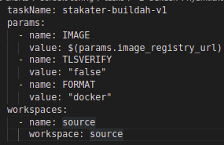
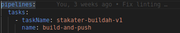
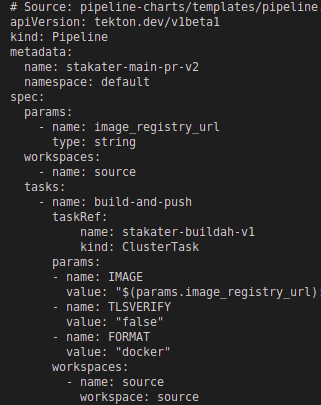
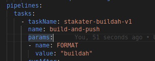
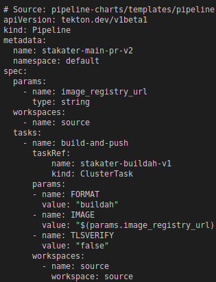
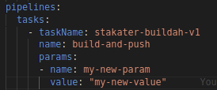
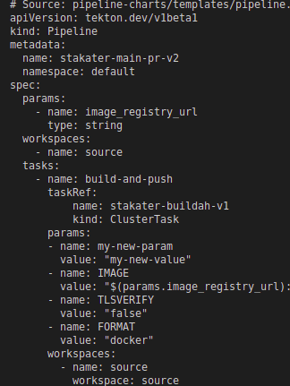
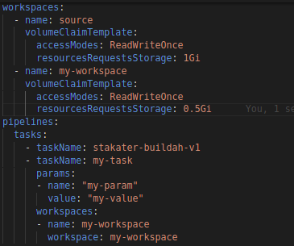
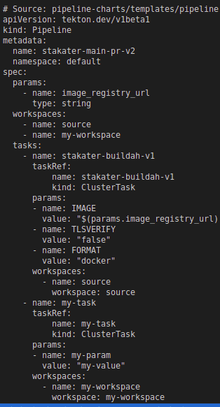

# Pipeline-Charts
Jumbo chart for creating pipeline manifests

## Installing the Chart

To install the chart with the release name my-application in namespace test:

    helm repo add stakater https://stakater.github.io/stakater-charts
    helm repo update
    helm install pipeline-1 stakater/pipeline-charts --namespace test

## Uninstall the Chart

To uninstall the chart:

    helm delete <name-of-the-chart>

## Chart Paramaters

| Name | Description                                                                                | Value                                       |
| ---| ---------------------------------------------------------------------------------------------|---------------------------------------------|
| name | Name of the pipeline manifests | ``                                          |
| workspaces | Workspaces used by pipeline ie volumeClaimTemplate, volumeClaimRef, configMaps, secrets | `{}`       |
#### Pipeline Paramaters

Pipeline parameters will be defined using the task parameter & Pipeline workspaces (.spec.workspaces) will be defined using .Values.workspaces

| Name                     | Description                                                                                  | Value           |
| ------------------------ | -------------------------------------------------------------------------------------------- | --------------- |
| pipeline.enabled | Enable pipeline manifest on helm chart                                                               | `true`          |
| pipeline.finally.tasks | Specify finally tasks.                                                              | ``          |
| pipeline.tasks[].name | Defaults to taskName, if there are multiple tasks of same name specify this field              | `name`      |
| pipeline.tasks[].taskName | Name of already existing task, will be used as pipeline step name by default                          | `taskname`      |
| pipeline.tasks[].params | Parameters required by the task for execution. default params combined with this field (will override default params) is used                                                | ``              |
| pipeline.tasks[].workspace | Workspaces required by the task for execution. default workspace combined with this field is used | ``|
| pipeline.tasks[].runAfter | Used to order task execution among tasks. default is previous task name, specify for complex flows. | ``              |
| pipeline.tasks[].when | specify when condition for tasks. overrides when in default | ``              |
| pipeline.tasks[].retries | specify task retries | ``              |

#### Trigger Template

| Name                     | Description                                                                                  | Value           |
| ------------------------ | -------------------------------------------------------------------------------------------- | --------------- |
| triggertemplate.enabled | Enable trigger template manifest on helm chart                                                | `true`          |
| triggertemplate.additionalParams | Parameters in addition to pipeline parameter in trigger template                     | `{}`            |
| triggertemplate.pipelineRunNamePrefix | Prefix value for pipelineRun name                                               | ``              |
| triggertemplate.serviceAccount | Service Account to be used for pipelineRun                                             | ``              |

#### Trigger Binding Parameters

| Name                     | Description                                                                                  | Value           |
| ------------------------ | -------------------------------------------------------------------------------------------- | --------------- |
| triggerbinding.enabled | Enable trigger bindings manifest on helm chart.                                                | ``              |
| triggerbinding.bindings | Trigger bindings ( > 1 ) name and parameters are passed to trigger template            | `{}`            |
| triggerbinding.bindings.name | Trigger bindings names                                                            | ``              |
| triggerbinding.bindings.bodyParams | Trigger bindings parameters                                                 | `{}`            |

#### Event listener Parameters

| Name                     | Description                                                                                  | Value           |
| ------------------------ | -------------------------------------------------------------------------------------------- | --------------- |
| eventlistener.enabled    | Enable event listener manifest on helm chart                                                 | ``              |
| eventlistener.triggers    | Define pipelines trigger templates in case of event, can use already existing trigger templates. Matches name with default triggers and uses its interceptors if not specified | `{}`        |
| eventlistener.triggers.name    | trigger name to find in default triggers. resulting name is prepended with pipeline-name | ``              |
| eventlistener.triggers.interceptors    | Define interceptor if its not defined in default triggers or override default trigger intercept | ``              |
| eventlistener.triggers.create    | If you dont want to create the trigger, set this false. useful for using predefined triggers.  | ``              |
| eventlistener.triggers.bindings    | Trigger Bindings to be passed to trigger templates                                 | `{}`            |

 
#### Event Listener Route Parameters

| Name                     | Description                                                                                  | Value           |
| ------------------------ | -------------------------------------------------------------------------------------------- | --------------- |
| route.enabled    | Enable route manifest for event listener on helm chart                                               | ``              |
| route.routeLabels    | Route labels to be added                                                                         | `{}`            |
| route.port.targetPort    | Target port of the backend service                                                           | ``              |
| eventlistener.wildcardPolicy  | Wildcard Policy of the route.                                                           | ``              |
| eventlistener.tls.termination    | tls termination criteria for route                                                   | `edge`          |
| eventlistener.tls.insecureEdgeTerminationPolicy    | Policy for insecure traffic                                 | `Redirect`      |

#### Add a Default Task
- Navigate to pipeline-charts/default-config/tasks directory & Make a new file.
- Specify taskName ( taskRef of kind:ClusterTask ), params & workspaces as specifed below: 
    # 
- Save this file.
- Now you can use this task in pipeline.spec.tasks[] in values.yaml as following:
    # 
    Name is required if multiple same task appears twice in pipeline.

- Resulting pipeline manifest
    # 

#### Overiding a Default Task
- For overwriting a default tasks params: 
    - specify it in spec.tasks[].params in values.yaml
        # 
    - Default Task in default-config/task
        # 
    - Resulting manifest after helm template
        # 
- For adding a default tasks params: 
    - specify it in spec.tasks[].params in values.yaml
        # 
    - Resulting manifest after helm template contains both default & defined params.
        # 

- RunAfter by default is the previous task name, but for complex flows, it is advised to define it. specify it in spec.tasks[].runAfter in values.yaml

- For adding a default tasks workspace, specify it in spec.tasks[].workspace in values.yaml, Resulting manifest will contain workspaces from here and default tasks if defined

- For overriding when clause, specify it in spec.tasks[].when in values.yaml

#### Adding a Custom Task
- Specify the new custom task in .spec.tasks[] as follows:  
        # 
- Resulting manifest:  
        # 

# Limitations

All current limitations in this chart.
-  All default parameters will be included in pipeline manifests. Feature to remove default params isnt added 

