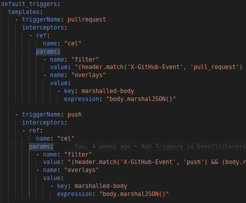
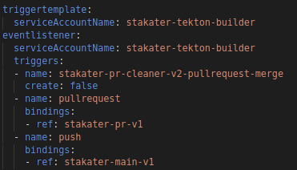
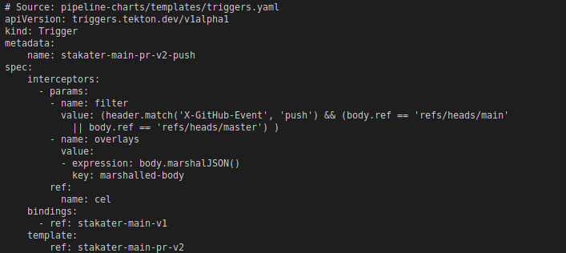

# Pipeline-Charts
Jumbo chart for creating pipeline manifests

## Features
- Define redundant configuration as default and create relatively smaller values files.
- Generate pipeline manifest with minimal values & configuration

## Notes
- You can add tasks configs as default and use them by taskName
## Installing the Chart

To install the chart:

### Using Helm CLI:

    `helm repo add stakater https://stakater.github.io/stakater-charts` or `helm repo update`
    `helm install pipeline-1 stakater/pipeline-charts --namespace test`
### Using Chart with dependencies  
Chart.yaml  

    apiVersion: v2
    dependencies:
    - name: pipeline-charts
        repository: https://stakater.github.io/stakater-charts
        version: 0.0.23
    description: Helm chart for Tekton Pipelines
    name: stakater-main-pr-v2
    version: 0.0.2
Values.yaml  

    pipeline-charts:
        name: stakater-main-pr-v2
        workspaces:
            - name: source
            volumeClaimTemplate:
                accessModes: ReadWriteOnce
                resourcesRequestsStorage: 1Gi
        # other configs below   ▼

## Paramaters

| Name | Description                                                                                | Value                                       |
| ---| ---------------------------------------------------------------------------------------------|---------------------------------------------|
| name | Name of the pipeline manifests i.e. pipeline,triggertemplate,route,eventlistener | ``                                          |
| workspaces | Workspaces used by pipeline ie volumeClaimTemplate, volumeClaimRef, configMaps, secrets (See values.yaml ) | `{}`       |
### Pipeline Paramaters

Pipeline parameters will be defined using the task parameter & Pipeline workspaces (.spec.workspaces) will be defined using .Values.workspaces

| Name                     | Description                                                                                  | Value           |
| ------------------------ | -------------------------------------------------------------------------------------------- | --------------- |
| pipeline.enabled | Enable pipeline manifest on helm chart                                                               | `true`          |
| pipeline.finally.tasks | Specify finally tasks.                                                               | `{}`          |
| pipeline.tasks[].name | Defaults to taskName, if there are multiple tasks of same name specify this field              | `name`      |
| pipeline.tasks[].taskName | Name of already existing task, will be used as pipeline step name by default , required                         | `taskname`      |
| pipeline.tasks[].params | Parameters required by the task for execution. default params combined with this field (will override default params) is used                                                | `{}`              |
| pipeline.tasks[].workspace | Workspaces required by the task for execution. default workspace combined with this field is used | `{}`|
| pipeline.tasks[].runAfter | Used to order task execution among tasks. default is previous task name, specify for complex flows. | `{}`              |
| pipeline.tasks[].when | specify when condition for tasks. overrides when field in default | `{}`              |
| pipeline.tasks[].retries | specify task retries | ``              |

### Trigger Template

| Name                     | Description                                                                                  | Value           |
| ------------------------ | -------------------------------------------------------------------------------------------- | --------------- |
| triggertemplate.enabled | Enable trigger template manifest on helm chart                                                | `true`          |
| triggertemplate.pipelineRunAnnotations | Annotations for pipelineRun | ``            |
| triggertemplate.pipelineRunNamePrefix | Prefix value for pipelineRun name                                               | ``              |
| triggertemplate.serviceAccount | Service Account to be used for pipelineRun                                             | ``              |

### Trigger Binding Parameters

| Name                     | Description                                                                                  | Value           |
| ------------------------ | -------------------------------------------------------------------------------------------- | --------------- |
| triggerbinding.enabled | Enable trigger bindings manifest on helm chart.                                                | ``              |
| triggerbinding.bindings | Trigger bindings ( > 1 ) name and parameters are passed to trigger template            | `{}`            |
| triggerbinding.bindings.name | Trigger bindings names                                                            | ``              |
| triggerbinding.bindings.bodyParams | Trigger bindings parameters                                                 | `{}`            |

### Event listener Parameters

| Name                     | Description                                                                                  | Value           |
| ------------------------ | -------------------------------------------------------------------------------------------- | --------------- |
| eventlistener.enabled    | Enable event listener manifest on helm chart                                                 | ``              |
| eventlistener.route    | Enable route manifest for event listener , targetPort,tls, routelabels configurable inside this field | ``              |
| eventlistener.serviceAccountName    | Service account for | ``              |
| eventlistener.triggers    | Define pipelines trigger templates in case of event, can use already existing trigger templates. Matches name with default triggers and uses its interceptors if not specified | `{}`        |
| eventlistener.triggers.name    | trigger name to find in default triggers. resulting name is prepended with pipeline-name | ``              |
| eventlistener.triggers.interceptors    | Define interceptor if its not defined in default triggers or override default trigger intercept | ``              |
| eventlistener.triggers.create    | If you dont want to create the trigger, set this false. useful for using predefined triggers.  | ``              |
| eventlistener.triggers.bindings    | Trigger Bindings to be passed to trigger templates                                 | `{}`            |

### Adding a Default Task
- Navigate to pipeline-charts/default-config/tasks directory & Make a new yaml file.
- Specify taskName ( taskRef of kind:ClusterTask ), params & workspaces as specifed below: 

        taskName: stakater-buildah-v1
        params:
        - name: IMAGE
            value: $(params.image_registry_url)
        - name: TLSVERIFY
            value: "false"
        - name: FORMAT
            value: "docker"
        workspaces:
        - name: source
            workspace: source

- Save this file.
- Now you can use this task in .values.pipeline.tasks[] in values.yaml as following:

        pipelines:
            tasks:
              - taskName: stakater-buildah-v1
                name: build-and-push

    Name is required if multiple same task appears twice in pipeline.

- Resulting pipeline manifest

        # Source: pipeline-charts/templates/pipeline.yaml
        apiVersion: tekton.dev/v1beta1
        kind: Pipeline
        metadata:
        name: stakater-main-pr-v2
        namespace: default
        spec:
        params:
        - name: image_registry_url
          type: string
        workspaces:
            - name: source
        tasks:
          - name: stakater-buildah-v1
            taskRef:
              name: stakater-buildah-v1
              kind: ClusterTask
            params:
            - name: IMAGE
              value: "$(params.image_registry_url)
            - name: TLSVERIFY
              value: "false"
            - name: FORMAT
              value: "docker"
            workspaces:
            - name: source
              workspace: source
### Overiding a Default Task
- For overwriting a default tasks params: 
    - specify it in .values.pipeline.tasks[].params in values.yaml

            pipelines:
                tasks:
                - taskName: stakater-buildah-v1
                    name: build-and-push
                    params:
                    - name: FORMAT
                    value: "buildah"

    - Default Task in default-config/task

            taskName: stakater-buildah-v1
            params:
            - name: IMAGE
                value: $(params.image_registry_url)
            - name: TLSVERIFY
                value: "false"
            - name: FORMAT
                value: "docker"
            workspaces:
            - name: source
                workspace: source

    - Resulting manifest after helm template

            # Source: pipeline-charts/templates/pipeline.yaml
            apiVersion: tekton.dev/v1beta1
            kind: Pipeline
            metadata:
            name: stakater-main-pr-v2
            namespace: default
            spec:
              params:
              - name: image_registry_url
                type: string
              workspaces:
                  - name: source
              tasks:
              - name: build-and-push
                taskRef:
                  name: stakater-buildah-v1
                  kind: ClusterTask
                params:
                  - name: IMAGE
                  value: "$(params.image_registry_url)
                  - name: TLSVERIFY
                  value: "false"
                  - name: FORMAT
                  value: "buildah"
                workspaces:
                - name: source
                  workspace: source

- For adding a default tasks params: 
    - specify it in .values.pipelines.tasks[].params in values.yaml
        # 
    - Resulting manifest after helm template contains both default & defined params.
        # 

- RunAfter by default is the previous task name, but for complex flows, it is advised to define it. specify it in .values.pipelines.tasks[].runAfter in values.yaml

- For adding a workspace to default, specify it in .values.pipelines.tasks[].workspace & in in values.yaml, Resulting manifest will contain workspaces from here and default tasks if defined

- For overriding when clause, specify it in .values.pipelines.tasks[].when in values.yaml

### Adding a Custom Task
- Specify the new custom task in .values.pipelines.tasks[] as follows:  
        # 
- Resulting manifest:  
        # 

### Adding a trigger
- Navigate to pipeline-charts/trigger.yaml
- Specify triggerName & interceptors under default_triggers.templates
    # 
- Now you can use this task in .values.eventlistener.triggers[] in values.yaml as following:
    # 
    Note:
    When create field is set to false, trigger isnt created. 
    Trigger is created with name field prepended.

- Resulting pipeline manifest
    # 

# Limitations

All current limitations in this chart.
-  All default parameters will be included in pipeline manifests. Feature to remove default params isnt added.
